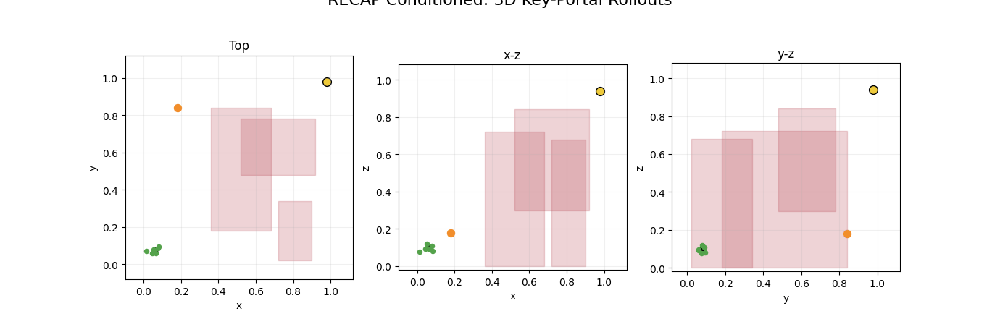
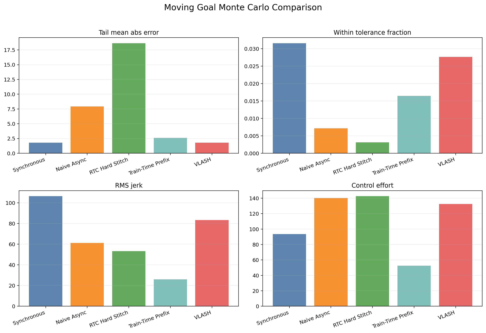

# VLA Ideas


[](LICENSE)
[](https://github.com/robodreamer/vla-ideas/stargazers)

Toy research prototypes for exploring visual-language-action timing, policy conditioning, and execution under latency. The repository currently contains three compact experiment tracks:

- `recap_pi`: RECAP-style advantage-conditioned navigation demos in 2D and 3D.
- `async_chunking_compare`: a lightweight simulator for comparing synchronous and asynchronous chunked-control strategies under inference delay.
- `prefix_rl_chunking`: a toy PPO + action-prefix-loss demo inspired by RL-for-chunked-VLA prefix-stability discussions.

## Preview

| RECAP-conditioned navigation | Async chunking comparison |
| --- | --- |
|  |  |

## Overview

This repo is organized as a small ideas lab rather than a polished framework. The focus is on quickly testing control and conditioning hypotheses, then exporting visual artifacts and short writeups that make the behavior easy to inspect.

### `recap_pi`

`recap_pi` contains toy navigation tasks that compare plain imitation-style rollouts against RECAP-style conditioning. It includes:

- 2D obstacle-navigation demos and comparison figures.
- 3D drone-heist style rollouts with animated outputs.
- extra variants for RL-token, counterfactual, and latent-adaptation experiments.
- a compact concept note and experiment writeups under `recap_pi/docs/`.

### `async_chunking_compare`

`async_chunking_compare` studies delay compensation for chunked action execution. It compares synchronous planning, stale-state async planning, future-state rollouts, and simple prefix/history-conditioned surrogates, then exports figures and trial CSVs for inspection.

### `prefix_rl_chunking`

`prefix_rl_chunking` turns the PPO + prefix-CFM stability idea into chunked-control toys, including a compact 1D reacher and a richer 2D pick/place environment. It compares a BC reference, PPO-only improvement, and PPO with an explicit prefix-copy loss, then exports metrics and summary plots.

## Quick Start

Set up the shared Python environment:

```bash
cd recap_pi
uv sync
```

Run the core RECAP demos:

```bash
cd recap_pi
uv run python recap_demo_complex_2d.py
uv run python recap_demo_game_3d.py
```

Run the async chunking comparison:

```bash
cd /home/andypark/Projects/playground/vla-ideas
recap_pi/.venv/bin/python async_chunking_compare/run_async_chunking_compare.py
```

Run the prefix-RL chunking toy:

```bash
cd /home/andypark/Projects/repos/vla-ideas
python prefix_rl_chunking/run_prefix_rl_chunking.py
python prefix_rl_chunking/run_prefix_rl_pickplace_2d.py
```

## What Gets Generated

The experiment scripts write visual outputs and reports directly into the repo so results stay easy to compare across iterations.

### `recap_pi/outputs`

- rollout GIFs for plain and RECAP-conditioned policies.
- side-by-side comparison plots for 2D and 3D tasks.
- additional assets for RL-token, counterfactual, and latent-adaptation variants.

### `async_chunking_compare/outputs`

- single-run and Monte Carlo comparison plots.
- delay-sweep plots.
- per-trial CSV exports for static and dynamic settings.

### `prefix_rl_chunking/outputs`

- PPO/BC comparison metrics and training curves for the 1D and 2D examples.
- summary plots showing success, safety stops, prefix-copy error, and representative rollouts.

## Current Snapshot

The existing `recap_pi` docs report these latest verified headline numbers:

- 2D plain imitation: 190 average effective steps, 17% success, 83% collisions.
- 2D RECAP-conditioned: 41 average effective steps, 100% success, 0% collisions.
- 3D plain imitation: 222 average effective steps, 19% success, 55% artifact pickup, 24% uplink activation, 79% collisions.
- 3D RECAP-conditioned: 111 average effective steps, 74% success, 100% artifact pickup, 74% uplink activation, 19% collisions.

## Repository Layout

```text
vla-ideas/
├── README.md
├── recap_pi/
│   ├── pyproject.toml
│   ├── recap_demo_complex_2d.py
│   ├── recap_demo_game_3d.py
│   ├── recap_demo_*.py
│   ├── outputs/
│   └── docs/
├── async_chunking_compare/
│   ├── run_async_chunking_compare.py
│   ├── outputs/
│   └── docs/
└── prefix_rl_chunking/
    ├── run_prefix_rl_chunking.py
    ├── run_prefix_rl_pickplace_2d.py
    ├── outputs/
    └── docs/
```

## Reports

- [`recap_pi/README.md`](recap_pi/README.md)
- [`recap_pi/docs/rl_tokens_experiment_report.md`](recap_pi/docs/rl_tokens_experiment_report.md)
- [`recap_pi/docs/recap_concept_writeup.pdf`](recap_pi/docs/recap_concept_writeup.pdf)
- [`async_chunking_compare/README.md`](async_chunking_compare/README.md)
- [`async_chunking_compare/docs/async_chunking_experiment_report.md`](async_chunking_compare/docs/async_chunking_experiment_report.md)
- [`async_chunking_compare/docs/async_chunking_report.pdf`](async_chunking_compare/docs/async_chunking_report.pdf)
- [`prefix_rl_chunking/README.md`](prefix_rl_chunking/README.md)
- [`prefix_rl_chunking/docs/prefix_rl_chunking_report.md`](prefix_rl_chunking/docs/prefix_rl_chunking_report.md)

## Star History

[](https://www.star-history.com/#robodreamer/vla-ideas&Date)

## Notes

- Large media artifacts are tracked with Git LFS.
- The code here is intentionally lightweight and experiment-oriented, not a general-purpose library.
