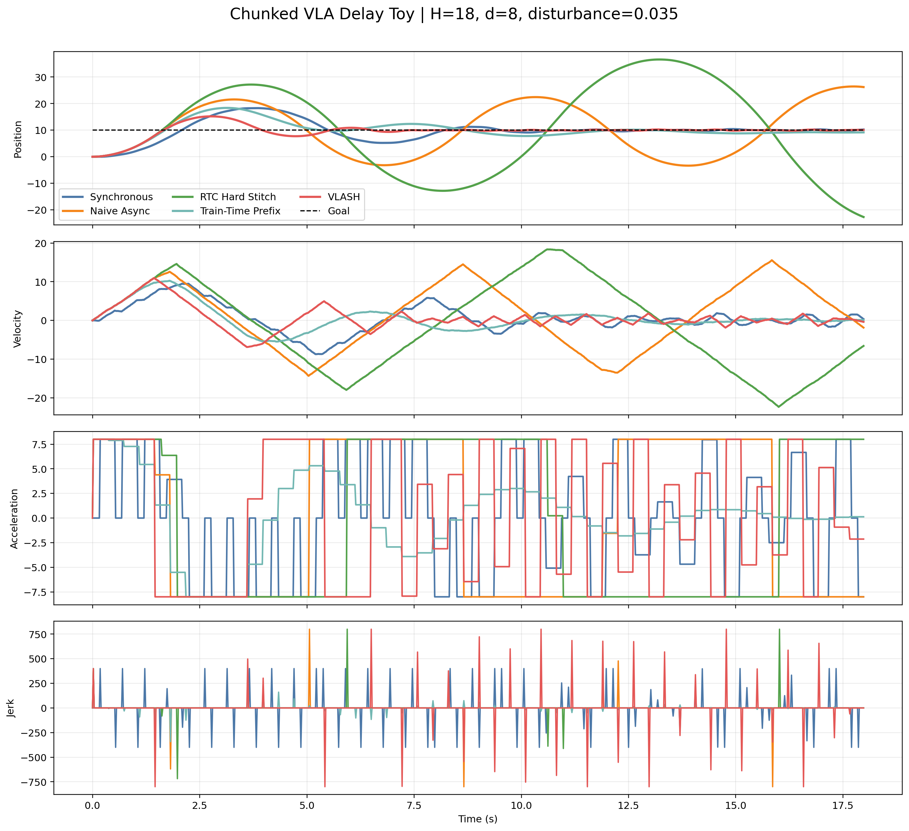
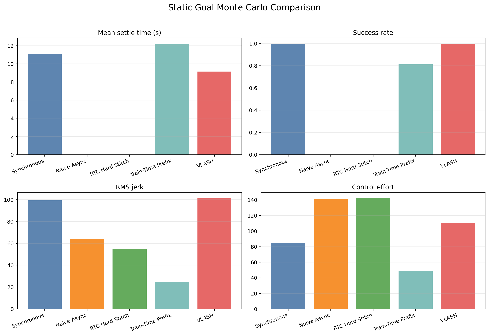

# Async Chunking Toy Experiment Report

This note records the current comparison status for toy delayed-action VLA deployment ideas in `async_chunking_compare/`.

## Bottom line

This report should be read as a toy delay-compensation note, not a finished benchmark. In this point-mass simulator, `VLASH` is the strongest method on the static-goal setting, the learned `Train-Time Prefix` baseline closes part of the gap without explicit rollout, and the crude `RTC Hard Stitch` fails badly because hard prefix freezing without inpainting breaks trajectory consistency.

The main qualitative pattern matches the motivating intuition from the papers:

- `Synchronous` is stable but slow because the robot pauses while replanning.
- `Naive Async` improves utilization but suffers stale-state oscillation.
- `RTC Hard Stitch` is a useful negative control, not a faithful RTC implementation.
- `Train-Time Prefix` learns to continue committed motion from stale observations plus the committed prefix.
- `VLASH` remains the strongest static-goal method because it aligns policy input to the future execution-time state directly.

## Implemented experiments

Script:

- `async_chunking_compare/run_async_chunking_compare.py`

Outputs:

- `outputs/async_chunking_static_single_run.png`
- `outputs/async_chunking_static_monte_carlo.png`
- `outputs/async_chunking_dynamic_single_run.png`
- `outputs/async_chunking_dynamic_monte_carlo.png`
- `outputs/async_chunking_delay_sweep.png`
- `outputs/async_chunking_static_metrics.csv`
- `outputs/async_chunking_dynamic_metrics.csv`
- `outputs/async_chunking_delay_sweep.csv`

### Static-goal scenario

Setup summary:

- Goal at `x=10.0`
- Chunk horizon `H=18`
- Delay `d=8`
- Control step `dt=0.02s`
- Velocity disturbance std `0.035`

Current results:

- Synchronous: `100%` success, `11.09s` mean settle, `0.164` final error, `99.4` RMS jerk
- Naive Async: `0%` success, `nans` mean settle, `6.469` final error, `64.3` RMS jerk
- RTC Hard Stitch: `0%` success, `nans` mean settle, `22.022` final error, `55.0` RMS jerk
- Train-Time Prefix: `81%` success, `12.24s` mean settle, `0.649` final error, `24.8` RMS jerk
- VLASH: `100%` success, `9.15s` mean settle, `0.054` final error, `101.5` RMS jerk

Interpretation:

- `Synchronous` eventually reaches the target but wastes wall-clock time in every planning gap.
- `Naive Async` keeps moving, but its commands were planned for the wrong physical state and it oscillates.
- `Train-Time Prefix` clearly improves over naive async by using the committed prefix as an implicit delay cue.
- `VLASH` is still better because it uses the exact rolled-forward future state instead of having to infer it.
- `RTC Hard Stitch` demonstrates why hard handoff alone is not enough; the missing inpainting step matters.

### Moving-goal scenario

Setup summary:

- Goal oscillation amplitude `1.20`
- Goal oscillation period `2.60s`
- Same `H=18`, `d=8`, `dt=0.02s`

Current results:

- Synchronous: `3%` within tolerance, `1.781` tail mean error, `1.617` final error, `106.4` RMS jerk
- Naive Async: `1%` within tolerance, `7.925` tail mean error, `8.059` final error, `61.2` RMS jerk
- RTC Hard Stitch: `0%` within tolerance, `18.645` tail mean error, `29.850` final error, `53.2` RMS jerk
- Train-Time Prefix: `2%` within tolerance, `2.602` tail mean error, `1.065` final error, `26.0` RMS jerk
- VLASH: `3%` within tolerance, `1.798` tail mean error, `1.340` final error, `83.3` RMS jerk

Interpretation:

- The moving target increases the penalty for stale state because the reference itself shifts during the delay window.
- `Train-Time Prefix` helps by damping large stale-state oscillations, but it lags the moving reference.
- `VLASH` stays competitive on tracking error and is cleaner than naive async in the trace, but the current moving-goal metrics do not show clean dominance over every baseline.
- This is the scenario where the biological internal-model analogy is most visible in the toy.

### Delay sweep

Interpretation:

- Small delays are tolerable for most methods.
- As `d/H` grows, `Naive Async` degrades first, then the learned prefix model, while `VLASH` remains usable longer.
- The hard-stitch negative control becomes unstable quickly, reinforcing that RTC's actual guidance step is doing real work.

## Next critical steps

1. Add credible baselines:
   - a faithful RTC-style baseline or remove RTC-comparison language
   - a history/recurrent baseline with stale observations plus committed prefix
   - a classical latency-compensation baseline such as MPC or Smith-predictor replanning
   - consistent reporting for `naive_reflex` and `vlash_reflex`

2. Upgrade the timing model:
   - sample inference latency from a distribution
   - include deadline misses and fallback behavior
   - add future-state model error so VLASH is not evaluated with exact nominal rollout only

3. Improve reporting:
   - export per-trial metrics, not only means
   - add confidence intervals or bootstrap intervals
   - use paired-seed comparisons
   - report overshoot, timeout rate, tracking lag, and safety-style violations

4. Expand scenario coverage:
   - sweep both delay and horizon
   - test disturbance shifts and dynamics mismatch
   - add at least one higher-dimensional constrained system

## Current conclusion

The current artifact is a useful toy demonstration of delay-compensation intuition, not yet a credible benchmark. The learned prefix-conditioned policy shows that some delay-awareness can be internalized during training, while explicit future-state alignment is still the strongest static-goal method. The next high-value step is to replace strawman baselines, add uncertainty-aware evaluation, and tighten the report to match only what the current outputs establish.
